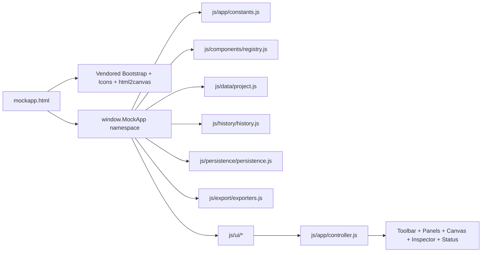

# Architecture

## Executive overview

MockApp is a buildless, offline-first browser application that opens from `file://` and uses only locally vendored runtime dependencies. The runtime is organized as focused classic-script modules attached to a shared `window.MockApp` namespace so the code remains split across many files without relying on ES module loading from local file URLs.

## Runtime architecture



## ASCII subsystem map

```text
mockapp.html
  -> vendor/bootstrap
  -> vendor/bootstrap-icons
  -> vendor/html2canvas
  -> js/app/namespace.js
     -> constants + utils
     -> component registry
     -> project tree model
     -> history snapshots
     -> persistence services
     -> exporters
     -> shell / sidebar / canvas / inspector renderers
     -> central controller
```

## Why classic scripts instead of ES modules

Direct local launch is a hard requirement. External classic scripts are consistently allowed from `file://` across current desktop browsers, while ES modules, import maps, `fetch()` of local files, and worker bootstrapping from `file://` are subject to browser-specific restrictions. MockApp therefore prefers:

- classic `<script src>` loading
- a shared namespace
- no runtime bundler requirement

## State model

Runtime state is split into:

- `project`: saved document model
- `history`: bounded past/present/future snapshots
- `selection`: current component ids
- `clipboard`: cloned component subtree
- `fileHandle`: optional File System Access API handle
- `ui`: active tab, preview mode, zoom, viewport preset, save status, panel widths, palette filter

The saved project model contains pages, explicit nested component trees, metadata, and editor settings.

## Module ownership

### App core
- `js/app/namespace.js`: shared namespace root
- `js/app/constants.js`: application, file format, viewport, breakpoint, and dependency versions
- `js/app/utils.js`: cloning, ids, downloads, object-path helpers
- `js/app/controller.js`: mutation orchestration and high-level actions
- `js/app/app.js`: DOM bootstrapping and command binding

### Components and data
- `js/components/registry.js`: centralized component metadata, inspector schema, and default canvas frame sizes
- `js/data/project.js`: project/page/component creation, normalization, traversal, insertion, removal, movement, frame updates, and validation

### Persistence and history
- `js/history/history.js`: bounded snapshot undo/redo
- `js/persistence/persistence.js`: autosave, preferences, recents, JSON save/load

### Export
- `js/export/exporters.js`: HTML, PNG, SVG, and clipboard JSON export

### UI
- `js/ui/shell.js`: refs, splitters, tab state, status updates, dialogs, toasts
- `js/ui/sidebar.js`: palette, pages, and layer tree rendering
- `js/ui/canvas.js`: canvas tree rendering and drop zones
- `js/ui/inspector.js`: structured property editor generation

## Rendering strategy

- The canvas renders trusted internal HTML templates generated from component metadata and escaped user content.
- The inspector is schema-driven from registry field definitions.
- The tree view and page list are separate left-panel surfaces.
- The page root is a freeform placement surface by default, while nested layout components still preserve Bootstrap semantics.

## Event strategy

The current implementation uses controller-owned actions bound directly from DOM events. The main event flow is:

1. User event in toolbar, palette, tree, canvas, or inspector
2. Controller action mutates project or UI state
3. Project is touched and autosaved when needed
4. History snapshot is updated for persistent changes
5. Full UI render refreshes sidebar, canvas, inspector, and status surfaces

This is intentionally explicit and easy to trace while the app is still growing.

## Persistence architecture

- Autosave: localStorage
- Preferences: localStorage
- Recent projects metadata: localStorage
- Manual save: File System Access API when available, otherwise download fallback
- Manual open: file input + FileReader + validation

## Export architecture

- HTML: generated Bootstrap markup referencing vendored local Bootstrap assets
- PNG: html2canvas capture of the current viewport surface
- SVG: `foreignObject`-based serialized export for reasonable modern-browser interoperability
- JSON clipboard: clipboard API fallback to error notice if unavailable

## Undo and redo

History currently uses bounded whole-project snapshots. This is simpler than a command stack, works well with nested tree editing, and remains reasonable for the current project scale. The main tradeoff is larger memory usage than patch-based history, but the implementation is predictable and low-risk while the data model stabilizes.

## Canvas model

The canvas is hierarchy-aware, but the page root defaults to a freeform placement surface. Root-level components persist explicit `frame` geometry (`x`, `y`, `width`, `height`) so users can place and move controls visually like a dedicated mockup tool, while nested Bootstrap layout structures remain explicit children.

Current drag-and-drop behavior supports:

- palette to page root at the pointer location
- palette to valid parent container
- moving existing root components by pointer-drag
- snapping dragged root components to the grid and nearby component edges or centers
- moving existing components into a different valid parent through canvas drop zones or layer drop targets

## Security notes

- User-controlled text is escaped before insertion into trusted templates.
- Raw HTML editing is intentionally excluded.
- Component rendering is centralized to reduce accidental unsafe DOM writes.

## File protocol strategy

- No runtime `fetch()` of local JSON files
- No ES module imports
- No runtime remote dependencies
- No worker-based architecture
- Local CSS, JS, fonts, and export dependencies only
